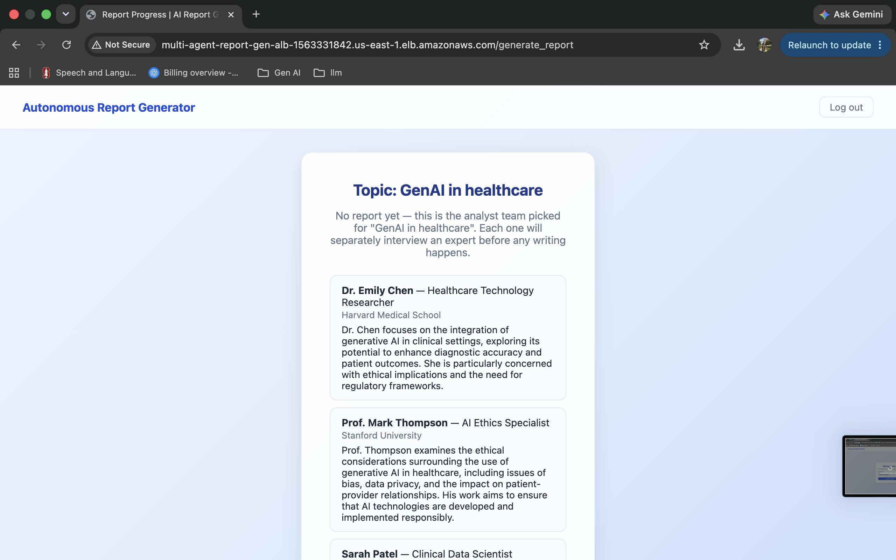
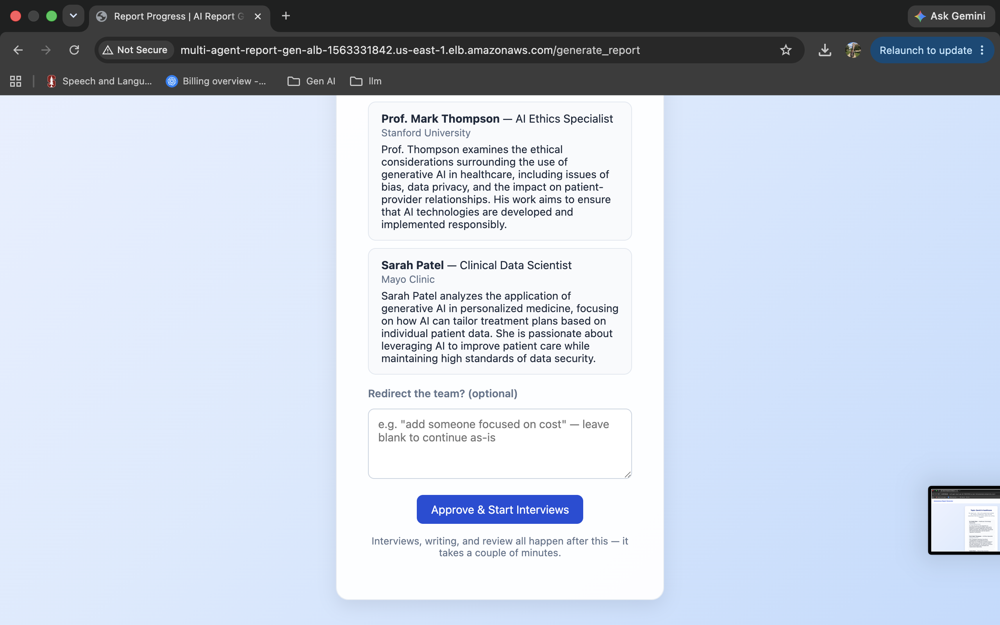
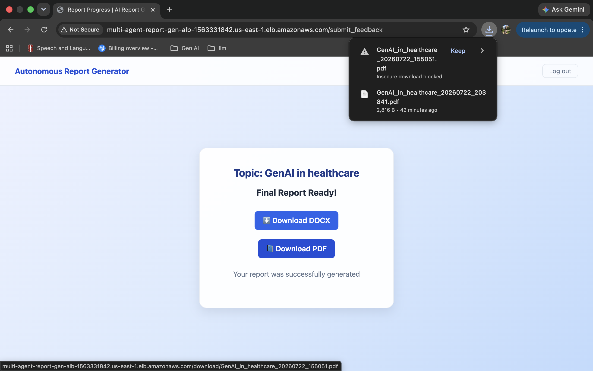

# Multi-Agent Research Analysis Report Generation System
**Live demo:** https://multi-agent-report-generator-nzv2.onrender.com/
**Live demo (AWS, CI/CD via GitHub Actions + Terraform):** http://multi-agent-report-gen-alb-1563331842.us-east-1.elb.amazonaws.com/

## Screenshots

Running live on AWS:

**Review the analyst team before interviews start:**


**Approve the team (or redirect it) to start interviews:**


**Final report, ready to download:**


## Run Locally

If it's already set up on this machine (venv, dependencies, `.env` all exist):

```bash
source .venv/bin/activate
uvicorn research_analysis_generation.api.main:app --reload
```

Then open `http://127.0.0.1:8000`.

From a fresh clone, set up first:

```bash
git clone https://github.com/MeghaUkkali9/Multi-Agent-Research-Analysis-Report-Generation-System.git
cd Multi-Agent-Research-Analysis-Report-Generation-System
uv venv .venv --python 3.11
source .venv/bin/activate
uv pip install -r requirements.txt
pip install -e .
```

Then create a `.env` file with your API keys — `OPENAI_API_KEY`, `GROQ_API_KEY`,
`TAVILY_API_KEY` are required, see `.env.example` for the full list. Then run
the two commands above.

Quick check that the model loader and keys actually work, before running the
full app:

```bash
python -m research_analysis_generation.utils.model_loader
```
Should print an embedding result and an LLM response — if either fails, the
`.env` keys are the first thing to check.

---

## Project Structure

```
src/
└── research_analysis_generation/
    ├── config/
    │   └── config.yml
    ├── utils/
    │   ├── model_loader.py
    │   ├── config_loader.py
    │   └── api_key_manager.py
    ├── logger/
    └── exception/
```

---

## Notes

* Uses `src/` layout (best practice for Python packaging)
* Requires `pip install -e .` for correct imports
* Avoid running files directly via absolute paths

## Deploy for Free (Render)

There's a `render.yaml` file in this repo, so nothing needs setting up by hand:

1. Push this repo to GitHub (already done, `origin` is set up).
2. Go to [render.com](https://render.com), sign up, click **New > Blueprint**,
   point it at this repo. Render reads `render.yaml` and builds the service
   itself.
3. It'll ask for `OPENAI_API_KEY`, `GROQ_API_KEY`, `TAVILY_API_KEY` (required)
   and `LANGFUSE_PUBLIC_KEY` / `LANGFUSE_SECRET_KEY` (optional, only for
   tracing). Check `.env.example` if you forget what each one is.
4. Once it's live you get a URL like `your-app.onrender.com`. Go back into the
   env vars, set `ALLOWED_ORIGINS` to that URL, redeploy.

## Deploy to AWS (CI/CD with Terraform + GitHub Actions)

This is the real deployment setup. Terraform builds the AWS side (ECS
Fargate, load balancer, ECR, IAM), and GitHub Actions builds and deploys a
new version every time something's pushed to `main`. Unlike Render, this
costs real money the whole time it's running — about $25-30/month, mostly
the load balancer. Destroy it when it's not being used.

**One-time setup:**

1. Install [Terraform](https://developer.hashicorp.com/terraform/install) and
   the [AWS CLI](https://docs.aws.amazon.com/cli/latest/userguide/getting-started-install.html),
   then run `aws configure` with an IAM user that can create these resources.
  
2. Set it up:
   ```bash
   cd infra
   terraform init
   terraform apply
   ```
   Look over what it's about to create, type `yes`. This makes: an ECR repo,
   an ECS Fargate cluster/service, a load balancer, IAM roles, empty Secrets
   Manager slots for the API keys, and a role GitHub Actions can use through
   OIDC — so no AWS keys ever sit in GitHub.

3. Grab two things from the output: `github_actions_role_arn` and `app_url`.

4. In GitHub: **Settings > Secrets and variables > Actions > Secrets**, add
   one named `AWS_DEPLOY_ROLE_ARN` with the `github_actions_role_arn` value.

5. Put the real API keys into Secrets Manager (Terraform only made empty
   placeholders — real keys never touch a `.tf` file or get stored in
   Terraform state):
   ```bash
   aws secretsmanager put-secret-value --secret-id multi-agent-report-gen/OPENAI_API_KEY --secret-string "sk-..."
   aws secretsmanager put-secret-value --secret-id multi-agent-report-gen/GROQ_API_KEY --secret-string "gsk_..."
   aws secretsmanager put-secret-value --secret-id multi-agent-report-gen/TAVILY_API_KEY --secret-string "tvly-..."
   aws secretsmanager put-secret-value --secret-id multi-agent-report-gen/LANGFUSE_PUBLIC_KEY --secret-string "pk-lf-..."
   aws secretsmanager put-secret-value --secret-id multi-agent-report-gen/LANGFUSE_SECRET_KEY --secret-string "sk-lf-..."
   ```
   All five need something in them, even a placeholder — ECS won't start the
   task otherwise.

6. Push to `main`. GitHub Actions builds the image, pushes it to ECR, deploys
   it. Right before this first run, the service shows 0 healthy tasks —
   that's normal, the infra exists before the app does.

7. Once the workflow finishes, open `app_url`.

**To stop paying for it:** run `terraform destroy` inside `infra/`. That
deletes everything, including the pushed images and the secret values.

A few things this setup doesn't do:
- No HTTPS. The load balancer only does plain HTTP. Adding HTTPS needs a
  real domain and a certificate.
- Nothing is saved permanently, same as Render, actually worse: `users.db`
  and generated reports live on the container's own disk, which disappears
  every time it redeploys or restarts. Making that permanent means switching
  to RDS for the database and S3 for the files — that's an app change, not
  an infra one, so it's not done here.

## How the Multi-Agent Part Works

1. **Create the analyst team.** One LLM call makes a few analyst personas —
   different names, different angles on the topic (say, one on tech, one on
   business impact). Then it pauses so someone can look at the team and edit
   or approve it before the expensive part (the interviews) starts.

2. **Each analyst interviews an expert, all at the same time.** Every analyst
   gets its own private interview. These run in parallel — they are separate
   conversations, not one shared chat. Inside one interview:
   - the analyst asks a question
   - the app searches the web for that question (Tavily)
   - the expert (same LLM, but a different role/prompt) answers using only what
     the search results say — nothing made up
   - this repeats for a few rounds (`max_num_turns`), or stops early if the
     analyst says "thank you, that's enough"

3. **Each analyst writes a short section** based on its own interview.

4. **Two separate checks run on that section, at the same time:**
   - an editor checks if the writing is specific and not generic filler
   - a fact-checker checks if every claim is actually backed by the search
     results, or if the writer invented something

   If either check fails, the section goes back to be rewritten, along with the
   feedback that explains what was wrong. This can repeat a couple of times
   (`MAX_SECTION_REVISIONS`), then it stops and keeps whatever version exists —
   so one strict check can't loop forever.

5. **Once every analyst has finished**, all the sections get combined into one
   report. A separate writer role does this combining, and it only sees the
   finished sections, not the raw interviews. That same step also writes its
   own intro and conclusion.

```
create_analyst
      |
human_feedback   <- pauses here for human review of the analyst team
      |
      +--> one interview per analyst, all in parallel
      |
      analyst asks question -> web search -> expert answers
      (repeat a few rounds, or stop early if analyst says thanks)
            |
      write_section
            |
      editor checks it  +  fact-checker checks it   <- both run together
            |
      not approved? -> rewrite with their feedback (up to a revision cap)
      approved (or cap hit) -> done with this section
      |
all sections combined into one report + intro + conclusion
      |
final report
```

Why this counts as multi-agent, not just one big prompt:

- Each analyst is its own persona with its own goals, not one LLM doing the
  same thing every time.
- Interviews run in parallel, each with its own state, no shared conversation.
- Inside one interview, the same LLM plays two roles that don't just trust
  each other — the analyst pushes for specifics, the expert only answers from
  what was actually searched.
- Editor and fact-checker are separate roles too, checking the work from two
  different angles instead of one agent grading itself.
- The report writer never sees the raw interviews, only the finished sections.
- A human gets a chance to step in before the expensive part (all the
  interviews) runs.

